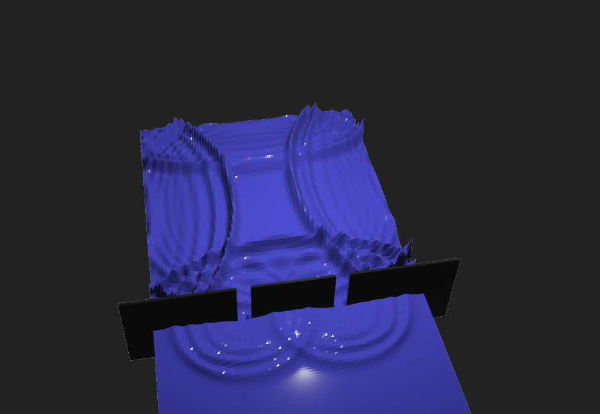

# Introduction

Waves occur in many different places. One of them being light, or surface waves over water which is simulated in an interactive demo. Waves have an important property, diffraction which occurs when a wave moves around an obstacle. These obstacles can include openings in a barrier.

Diffraction is used to show that light has wave properties in the double slit experiment. In this experiment light shines through two small slits and as the light diffracts through the two openings circular waves are formed. As the two waves interfere with each other a diffraction pattern is formed. A diffraction pattern, collected in a PHYS 213 lab is shown below.

# Simulation

The equations that are used in the model are simplified from the shallow water equations in order to make
simulation easier. They describe propagation of linear gravity waves in a shallow body of water.

The simulation uses the Arakawa grid [1] that is shown below. The velocities' grid is offset from the height
grid in
order to
represent flow between height cells. If the velocity components were not offset then the water velocities
would represent net flux of water at a given point rather then the velocity of water between two grid cells.

The discretized equations used in the water simulation are shown below. Equations (1,2) calculate velocities
and equation (3) calculates the
change in height. Equations (4,5) define the half indicies used in equation (3).

           

##  Time Stepping Scheme

The simulation uses the Matsuno time stepping scheme. The Matsuno scheme is used rather then a simple
explicit time
stepping scheme
because it results in a more stable simulation. If an simple explicit time step was used then the model can
start oscillations leading to instability. Let us define the Matsuno scheme for the following vector
equation:

First a half time step is taken as shown below,

Next a full time step forward is taken using the information generated from the half time step.

Next a full time step forward is taken using the information generated from the half time step.
The scheme is a modification of the well known family of Runge-Kutta time stepping schemes [2] which is
widely used in other fields.

## Limitations of Model

The model inherits the limitations form the shallow water equations as discussed in the Shallow Water
Equations Section. 

Introduction:

Waves, Properties of waves, Application to light because wave model

Description of system, swe matsuno etc...

# Model Compared to Light

The model was validated by performing the double experiment. The same conditions can be found by clicking "double slit" in the main menu. The model was run as shown below and a cross section of the water heights was grabbed 20 units behind the two slits. 

The wavelength, and slits spacing was used in the following equation from [3] in order to calculate the theoretical wavelength.

The measured theta is 0.278. A possible explanation of the discrepancy is that the propagation of the waves was not ideal or the slits were not close enough together. The model is also limited in resolution as simulation happens in real time. This limited how small the slit and slit spacing could be relative to the length of the transect.

# Conclusions and Future Directions
The model is directly inspired and based off of previous projects including one in physics 212. Most of the effort was placed into solving bugs causing instability in the model that were visible once the simulation speed and duration was increased and improving user interface. The model could be improved by including viscosity and varying base heights. If varying base heights are simulated then more phenomena can be modeled such as rivers or the propagation of tsunamis.

The model may also be useful as a teaching tool. I personally found the model was helpful in visualizing double slit interference. In the future it may be interesting to add the ability to draw transects of water height into the model in order to allow theoretical interference pattern to be drawn by the program.
# References
## [1] Enstrophy and Energy Conserving Scheme for the Shallow Water Equations 

(https://journals.ametsoc.org/view/journals/mwre/109/1/1520-0493_1981_109_0018_apeaec_2_0_co_2.xml) 

(Akio Arakawa and Vivian R. Lamb )

## [2] Family of embedded Runge-Kutta formulae
(https://doi.org/10.1016/0771-050X(80)90013-3) (J.R.Dormanda and P,J. Prince )

## [3] Physics for Scientists and Engineers- A strategic approach
Page 392.
(Randall D. Knight)
## [4] (https://www.mathworks.com/content/dam/mathworks/mathworks-dot-com/moler/exm/chapters/water.pdf) Shallow Water Equations (Mathworks)

