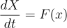
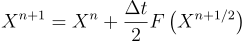

Outline

Main:

Game Demo!

# Introduction

Waves occur in many different places. One of them being light, or surface waves over water which is simulated in an interactive demo. Waves have an important property, diffraction which occurs when a wave moves around an obstacle. These obstacles can include openings in a barrier.

Diffraction is used to show that light has wave properties in the double slit experiment. In this experiment light shines through two small slits and as the light diffracts through the two openings circular waves are formed. As the two waves interfere with each other a diffraction pattern is formed. A diffraction pattern, collected in a PHYS 213 lab is shown below.

# Simulation

The equations that are used in the model are simplified from the shallow water equations in order to make
simulation easier. They describe propagation of linear gravity waves in a shallow body of water.

The simulation uses the Arakawa grid [1] that is shown below. The velocities' grid is offset from the height
grid in
order to
represent flow between height cells. If the velocity components were not offset then the water velocities
would represent net flux of water at a given point rather then the velocity of water between two grid cells.

The discretized equations used in the water simulation are shown below. Equations (1,2) calculate velocities
and equation (3) calculates the
change in height. Equations (4,5) define the half indicies used in equation (3).

           

##  Time Stepping Scheme

The simulation uses the Matsuno time stepping scheme. The Matsuno scheme is used rather then a simple
explicit time
stepping scheme
because it results in a more stable simulation. If an simple explicit time step was used then the model can
start oscillations leading to instability. Let us define the Matsuno scheme for the following vector
equation:

First a half time step is taken as shown below,

Next a full time step forward is taken using the information generated from the half time step.

Next a full time step forward is taken using the information generated from the half time step.
The scheme is a modification of the well known family of Runge-Kutta time stepping schemes [2] which is
widely used in other fields.

## Limitations of Model

The model inherits the limitations form the shallow water equations as discussed in the Shallow Water
Equations Section. 

Introduction:

Waves, Properties of waves, Application to light because wave model

Description of system, swe matsuno etc...

# Model Compared to Light

## Experiment stuff, double slit etc...

Model does single slit bla bla but not 3d and mistake in boundry conditions. 

SWE is not maxwell equations so some results may not be physical.

# Conclusions and Future Directions

Performance of model:

Screenshots of different situations

Differences from light

Not 3d etc....

Conclusions+ Future Directions

